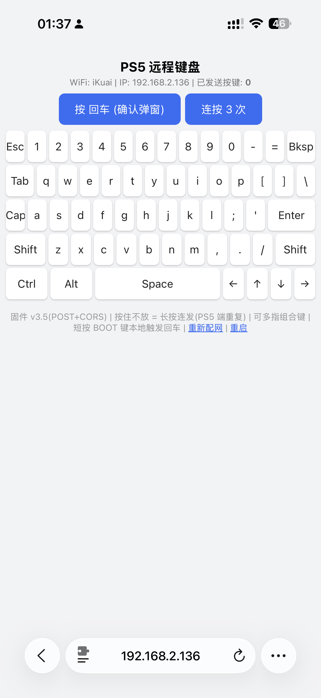

# keyboard_web_for_esp32

ESP32-S2/S3 USB HID 键盘固件：把开发板变成一个**插在主机上的真键盘**，通过浏览器网页或 HTTP 接口远程按键。

打开 `http://ps5key.local/` 即是完整虚拟键盘 —— 按下即发 key-down、松开发 key-up，支持长按（主机端自动重复）、多键组合，手感和真键盘一致。

## 为什么做这个

最初的场景是 PS5：意外断电重启后会弹「未正确关闭 / 正在修复存储」确认框，远程唤醒（蓝牙）后没人按键就卡死在那里。实测发现普通 USB 键盘按回车即可确认（标准 HID 免 Sony 认证），于是用 ¥15 的 ESP32-S3 模拟一个 USB 键盘插在 PS5 上，断电恢复后手机打开网页按一下回车即可。

当然它是个通用方案，插在任何接收 USB 键盘的设备上都行：PS5 / PC / Mac / 树莓派 / 安卓盒子……

## 功能

- 🎮 **完整虚拟键盘网页**：QWERTY 全键盘 + Esc/Tab/Caps/Shift/退格/空格/方向键/Ctrl/Alt
- ⌨️ **真键盘交互模型**：pointerdown → key-down、pointerup → key-up；长按连发由主机端处理（同真键盘）；可同时按住多个键出组合键
- 📶 **WiFiManager 配网**：首次上电发热点 `PS5Key-Setup`，手机连上自动弹配置页，无需写死 WiFi
- 🔗 **mDNS**：直接访问 `http://ps5key.local/`
- 🌐 **HTTP API**：所有端点 GET/POST 通用，含 JSON 接口，已开 CORS，方便脚本/家庭自动化调用
- 🔘 **BOOT 键**：短按 = 本地按一次回车；按住上电 = 清除 WiFi 重新配网
- ⏱️ 可选自动模式：上电 N 秒后自动按一次回车（默认关闭）

## 硬件要求

- **ESP32-S2 或 ESP32-S3** 开发板（必须有原生 USB 口），约 ¥15~25
  - 源码两种都支持，代码零修改
  - 仓库内预编译固件**只适配 ESP32-S3**（S2 需自行编译，见下方说明）
- ⚠️ 普通ESP32（无 S2/S3 后缀）没有原生 USB，**模拟不了键盘**
- USB 数据线插到目标主机（PS5 / PC / Mac）的 USB 口

## 烧录

### 方式一：Arduino IDE（推荐）

1. 库管理器（工具 → 管理库）搜 **WiFiManager**，安装作者 **tzapu** 的那个
2. 开发板选 **ESP32S2 Dev Module** 或 **ESP32S3 Dev Module**
3. 工具 → **USB Mode → USB-OTG (TinyUSB)** ← 必须，否则主机识别不到键盘
4. 工具 → USB CDC On Boot → **Disabled**
5. 打开 `keyboard_web_for_esp32/keyboard_web_for_esp32.ino`，烧录即可，无需改代码

### 方式二：直接刷预编译固件

[firmware/](firmware/) 内含 v3.5 预编译镜像（ESP32 core 3.3.11 编译）：

| 文件 | 说明 |
|---|---|
| `keyboard_web_for_esp32.v3.5.4MB.merged.bin` | 4MB Flash 合并镜像（含引导程序+分区表） |
| `keyboard_web_for_esp32.v3.5.8MB.merged.bin` | 8MB Flash 合并镜像（含引导程序+分区表） |
| `keyboard_web_for_esp32.ino.bin` | 1MB app 镜像（刷 0x10000，不含引导程序） |

> ⚠️ **预编译固件仅适用于 ESP32-S3**（按 `esp32s3` 目标编译，含 S3 专用的引导程序/分区表，刷到 S2 无法启动）。
> **ESP32-S2 用户请用方式一从源码编译**：开发板选 "ESP32S2 Dev Module"，代码无需任何修改。
> 普通版 ESP32（无 S2/S3 后缀）无原生 USB，源码编译也不行。

```bash
pip install esptool
esptool.py --port /dev/cu.usbmodemXXXX --baud 921600 write-flash 0x0 keyboard_web_for_esp32.v3.5.8MB.merged.bin
```

> merged 镜像会清除 WiFi 配置，刷完需重新配网。

## 使用

### 首次配网

1. 上电后 ESP32 发出热点 `PS5Key-Setup`
2. 手机/电脑连上，自动弹出配置页（没弹就手动打开 `http://192.168.4.1`）
3. 选家里 WiFi 输密码 → 保存，自动记住，以后上电直连（仅支持 2.4GHz）

### 网页键盘

与目标主机同一局域网内，浏览器打开 **http://ps5key.local/**，直接点按即可。
换 WiFi / 配错了：按住板上 BOOT 键再上电，或访问 `http://ps5key.local/resetwifi`。

### 截图展示



### HTTP API（GET/POST 通用，已开 CORS）

```bash
curl http://ps5key.local/enter                 # 按一次回车
curl "http://ps5key.local/enter?n=3&gap=800"   # 连按 3 次,间隔 800ms
curl "http://ps5key.local/type?t=hello"        # 整串打字(仅 ASCII)
curl "http://ps5key.local/tap?d=97"            # 点按单个键
curl "http://ps5key.local/down?d=128"          # 按住不松(组合键用)
curl "http://ps5key.local/up?d=128"            # 松开
curl http://ps5key.local/cnt                   # 查询已发送按键计数

# JSON 接口(v3.5+)
curl -X POST http://ps5key.local/key \
     -H "Content-Type: application/json" \
     -d '{"d":176,"a":"tap"}'                  # d=键码, a=down|up|tap
```

常用键码：回车 `176`、Esc `177`、退格 `178`、Tab `179`、Caps `193`、← `216`、→ `215`、↑ `218`、↓ `217`、空格 `32`、LCtrl `128`、LShift `129`、LAlt `130`、字母/数字直接用 ASCII 码。

其他端点：`/resetwifi`（清除配网并重启）、`/reboot`（重启）。

## 已知限制

- 只支持 ASCII 输入（英文/数字/符号）；中文需目标设备自带输入法逐字母敲
- 键盘发不了 PS5 的 PS 键，PS5 唤醒需另想办法（本项目作者用的是 RTL8761B 蓝牙寻呼方案）
- 页面同时按住的键数受 USB HID 报文上限约束（最多 6 个普通键 + 修饰键）

## 开发备注（踩坑记录）

**网页 HTML 必须放在独立的 `page.h`，不能内嵌在 `.ino` 里。**
Arduino 的 .ino 预处理器不理解原始字符串字面量（raw literal），会把页面 JS 里的 `function xx(){` 误识别为 C++ 函数定义，自动生成的函数原型连同 `#line N "file"` 指令一起被注入进 PROGMEM 字符串，浏览器直接报 `SyntaxError: Bare private name`，整页 JS 报废（实测于 arduino-esp32 core 3.3.11）。预处理器只处理 .ino 不碰 .h，把页面挪进 `page.h` 即可根治。

## License

[MIT](LICENSE)
